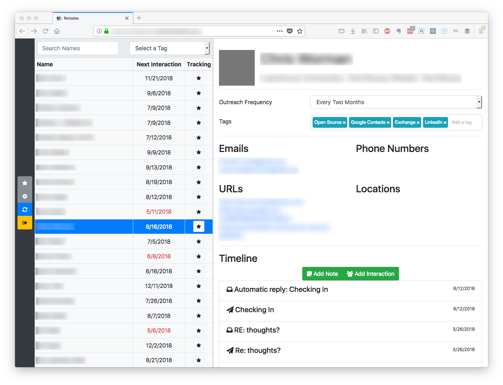

# Rolodex

[](https://travis-ci.org/johnjones4/FeedPage)

[](https://github.com/standard/standard)



Rolodex syncs Google, Exchange, and LinkedIn contacts into one master list and helps you manage and track relationships.

## Setup

Rolodex may be run in a container with the following command. Note that you will need to setup an API project on the Google APIs console and enable the Contacts API, Geocoding API, and the People API.

```sh
docker run \
  --env GOOGLE_CONTACTS_CLIENTID=<Obtain this from the Google APIs console> \
  --env GOOGLE_CONTACTS_CLIENT_SECRET=<Obtain this from the Google APIs console> \
  --env GOOGLE_API_KEY=<Obtain this from the Google APIs console> \
  --env JWT_SECRET=<Random string> \
  --env LOGIN_USERNAME=<Specify the login username> \
  --env LOGIN_PASSWORD=<Specify the login password> \
  --env PORT=80 \
  --port 80:80 \
  johnjones4/rolodex
```
